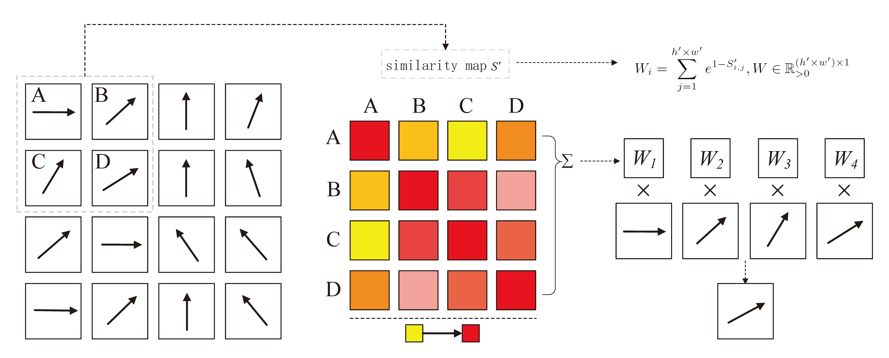

# Agreement aware and dissimilarity oriented GLOM
This is a project presenting code of our paper "Agreement aware and dissimilarity oriented GLOM" which is accepted by ICCV 2025.

GLOM is a neural network model proposed by Professor Geoffrey Hinton in 2021. The main idea of GLOM was to build a system that is not only powerful but also more interpretable, showing how parts come together to form wholes, similar to how humans understand visual scenes.

We proposed a new implementation of GLOM that aligns more closely with GLOM's theoretical framework for forming hierarchies of grouped embeddings to represent nodes in a parse tree.


## Challenges
1. Current implementations struggle to produce identical vectors that reliably converge to represent nodes in a parse tree.

2. GLOM is computationally intensive due to the need to maintain equal resolution across all levels.

## Contritutions
1. A novel contrastive agreement enhancer is designed to promote agreement between positive embedding pairs while pushing apart negative pairs, thereby forming distinct “islands.”


2. A dissimilarity-focused head is developed to reduce redundancy in the top-level embeddings, preserving more informative content by concentrating on embeddings with lower similarity, which tend to contain more useful information.



## Setup
install the required packages

```python
pip3 install -r requirements.txt
```

## Training/Validation/Testing
The setting of GLOM can refer to the file "GLOM_settings". 

To train the model, you should properly set the "mode", "supervise", and "resume_training"

## Citing

## Credits
